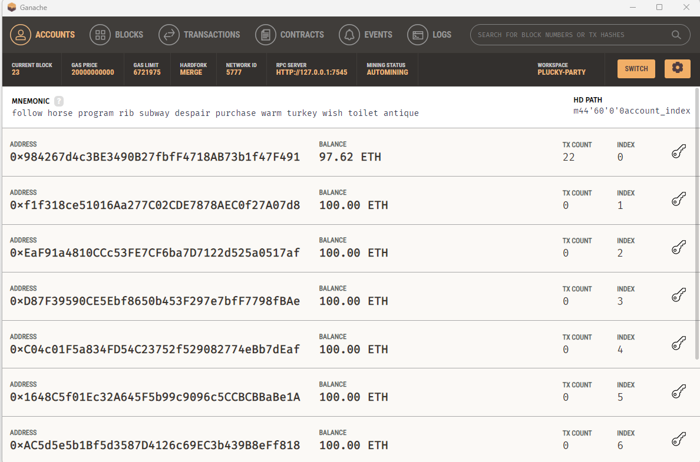
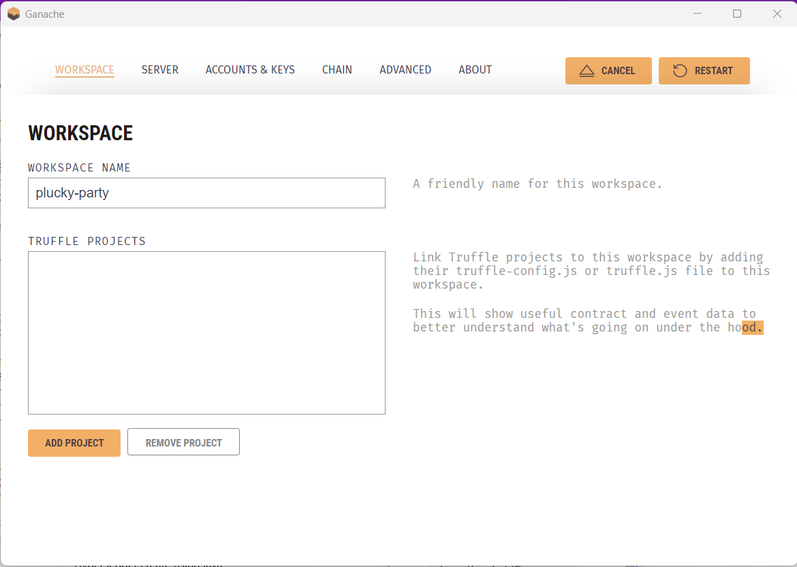

## Ganache
Personal Ethereum Blockchain. (Local VM).

### Download & Install
Download: https://trufflesuite.com/ganache/

### Run Ganache
We can following these steps:
1. Open ganache, choose `Quickstart`. 
2. We can see 10 address account simulator for each 100 eth. 
3. If we click on :key: `Key Button` We can see Account Information about the `Account Address` and `Private Key`. 
4. Here is importent configuration about workspacename, server hostname, port number, gas price, can watch here. 